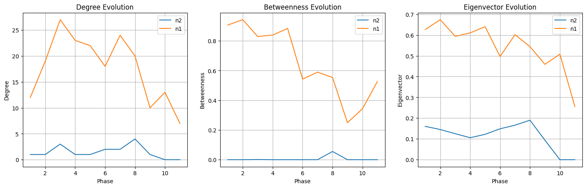
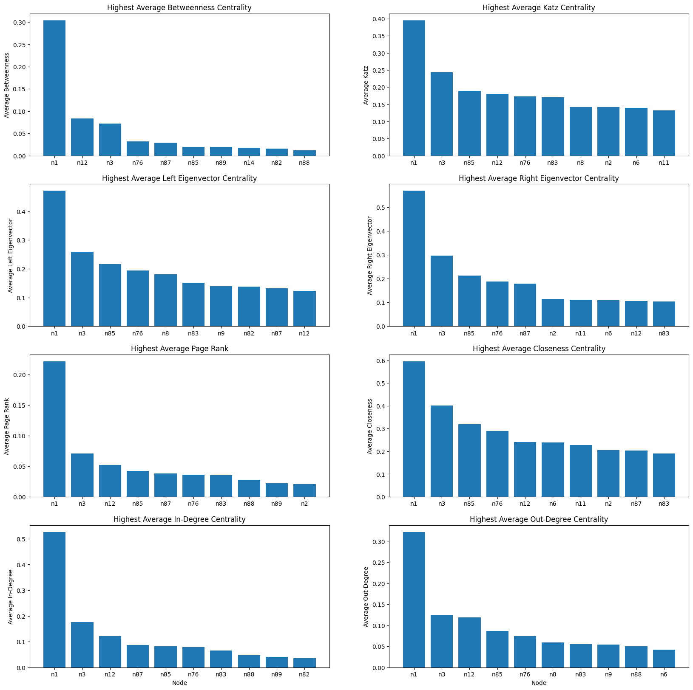

# Module 3 - Networks: Written Analysis, Peer Review and Discussion

Name: eddysanoli

## Problem 1

### **Part (c) (2 points) (100 word limit.)**

How does the time complexity of your solution involving matrix multiplication in part (a) compare to your friend's algorithm?

- The time complexity of "my friends" (naive) algorithm is O(n^3). The matrix method, on the other hand, consists of a transpose (O(n) according to [IEEE](https://ieeexplore.ieee.org/document/6131813)) and a matrix multiplication, which can be done in O(n^3) if done by hand. By compounding both notations, we get a time complexity of O(n^3), the same as the naive algorithm. However, time complexity only reflects the asymptotic behavior of the algorithm, so one can be faster by the other in practice. For example, thanks to many optimizations, matrix multiplication can now be computed more efficiently, taking the time complexity to a value closer to [O(n^2.3)](https://arxiv.org/abs/2210.10173).

### **Part (d) (3 points) (200 word limit.)**

Bibliographic coupling and cocitation can both be taken as an indicator that papers deal with related material. However, they can in practice give noticeably different results. Why? Which measure is more appropriate as an indicator for similarity between papers?

- The difference is subtle, but I think the main reason why they both end up with drastically different results comes down to the direction in which the relationship between citation and citee is summarized. In cocitation we are summarizing the amount of papers that share a citation in a common paper, or how many papers use the same common source (papers -> source). In bibliographic coupling, we are summarizing the number of papers that cite a common paper or how many sources do a pair of papers share (source -> papers). If we assume that two papers will be more similar if they share a common source, then bibliographic coupling is the better measure, as it will give a higher score to paper pairs that share the most amount of sources. Cocitation on the other hand would be better suited to measure the relevance of a paper, as it will give a higher score to paper pairs that are cited by the highest amount of papers, basically giving a summary on how widespread their contributions have been.

----

## Problem 2

### **Part (c) (2 points) (100 words, 200 word limit.)**

Observe the plot you made in Part (a) Question 1. The number of nodes increases sharply over the first few phases then levels out. Comment on what you think may be causing this effect. Based on your answer, should you adjust your conclusions in Part (b) Question 5?

- In phase 3, the number of connections surged from 28 to 56, as operations intensified without any seizures. Plotting the evolution of node degrees shows that most players remained loosely coupled with only a few key players, including n1, n3, n12, n83, and n85, experiencing drastic changes in connections as the phases progressed. These findings support the answers found in "Part (b) Question 5", except for node n83. For the rest, the growth pattern aligns with expectations given Daniel Serero's (n1) and Pierre Perlini's (n3) roles as the operation mastermind and former lieutenant, respectively. The new cash influx also probably required an accountant, explaining Wallace Lee's (n85) involvement. Ernesto Morales (n12) served as a main cocaine supplier, which is also a vital role. Alain is the only player not mentioned in Question 5, probably due to him displaying a sudden drop in connections after phase 3, likely due to the first seizure. However, he is the 4th most connected node, so his contribution was still very significant as he probably provided most of the initial funding.


### **Part (d) (5 points) (300 words, 400 word limit.)**

In the context of criminal networks, what would each of these metrics (including degree, betweenness, and eigenvector centrality) teach you about the importance of an actor's role in the traffic? In your own words, could you explain the limitations of degree centrality? In your opinion, which one would be most relevant to identify who is running the illegal activities of the group? Please justify.

- Degree centrality measures the number of connections that a node has. If a player has a small degree centrality, it will probably mean that they are someone lower in the chain of command (like a dealer), while players with a large degree centrality will probably fulfill more important roles. However, this measure only captures the importance of immediate connections between nodes, so the actual importance of a node could be undermined. For example, if the mastermind of the operation chose to be very secretive and handle everything through a third party, its degree would've been really low, since he would've have only 1 connection, while being the most important player in the operation.

   Then we have betweenness centrality. By definition, betweenness measures the number of times a node acts as a bridge along the shortest path between two other nodes. In this context, a higher betweenness centrality value could indicate that the node is either a middleman connecting the lower and higher ranks (which would explain why the cocaine importer n12 appeared as one of the nodes with the highest betweenness) or that they are one of the most important figures in the organization, as they are the ones connecting or "glueing together" different sectors of the operation. This would explain why n1 (the mastermind) and n3 (the lieutenant) appeared as two of the nodes with the highest betweenness centrality.

   Finally, we have eigenvector centrality. This type of centrality measures the importance of the nodes that a player is connected to (or are connecting to it). This is why n1 and n3 appeared as two of the players with the highest eigenvector centrality, they are the most important when running the organization as they are basically giving out the orders to everyone down the chain of command. Because of this, I think this would be the best measure to use when identifying key players in the organization. It sorts out actors by their relevance. Once the most important are identified, betweenness centrality could be used to identify the middlemen. By arresting both the most relevant players and their middlemen, the organization should see a significant decrease in its activity.

### **Part (e) (3 points) (100 words, 200 word limit)**

In real life, the police need to effectively use all the information they have gathered, to identify who is responsible for running the illegal activities of the group. Armed with a qualitative understanding of the centrality metrics from Part (d) and the quantitative analysis from part Part (b) Question 5, integrate and interpret the information you have to identify which players were most central (or important) to the operation.

Hint: Note that the definition of a player's “importance" (i.e. how central they are) can vary based on the question you are trying to answer. Begin by defining what makes a player important to the group (in your opinion); use your answers from Part (d) to identify which metric(s) are relevant based on your definition and then, use your quantitative analysis to identify the central and peripheral traffickers. You may also perform a different quantitative analysis, if your definition of importance requires it.

- I believe that the most important players in the trafficking operation are those who provide the most cohesion in the network, bringing together disparate parts to keep the operation going. For example, a key player could be the main drug supplier, as without them, the rest of the operation would halt while the higher ranks search for a replacement.

   With that in mind, I believe that we can use eigenvector centrality to identify the players with the most influence in the network, and then complement the list of suspects with those with the highest betweenness centrality to also identify their most influential middlemen. This leads us to n1 (the mastermind), n3 (his lieutenant), n12 (the cocaine importer), n83 and n87 (the investors), n76 (procurement of marijuana) and n85 (the accountant). The order in which they are captured matters as well: The middleman should be captured first (n85, n76, n83, n87), as they could communicate with the higher ranks in order to warn them, and very soon after, the rest should be captured (n1, n3, n12) to completely dismantle the operation. This will leave the lower ranks unorganized and vulnerable, making it easier to capture them as well.


### **Part (f): Question 2 (3 points) (200 words, 300 word limit)**

The change in the network from Phase X to X+1 coincides with a major event that took place during the actual investigation. Identify the event and explain how the change in centrality rankings and visual patterns, observed in the network plots above, relates to said event.

- The major event that took place in phase 4 was the first seizure. Based on the visual progression of the graph and the evolution in the number of edges and nodes, it seems like after the first seizure, and throughout phase 5, most of the momentum that the operation had going was lost due to a big chunk of the most important players starting to act more cautiously and the non-trafficker members scattering. This can be evidenced by the fact that the nodes that disappeared from phase 3 to 4 were mainly non-trafficker nodes, as well as having the number of edges in the overall graph decrease from 56 to 48 (an 11% reduction), with the highest drop-off coming from Antonio Iannacci (n89), one of the investors.

   He probably saw the clientele starting to fall after the first seizure, and decided to pull most of the funding he provided to the project, not only slowing down operations as the financial resources decreased, but also lowering the interest in other players like Wallace Lee (n85), the operation's accountant. This tendency continued until phase 6, when the operation moved from trafficking marijuana, to trafficking cocaine, causing a slight surge in connections and other centrality measures (like betweenness and eigenvector centrality) in some players.

   Another thing worth mentioning is that Daniel Serero, the mastermind of the operation, saw a gradual decrease in almost all centrality measures as the phases progressed, which could indicate that he was getting more and more cautious as the operation was getting more and more dangerous.


### **Part (g) (4 points) (200 words, 300 word limit.)**

While centrality helps explain the evolution of every player's role individually, we need to explore the global trends and incidents in the story in order to understand the behavior of the criminal enterprise.

Describe the coarse pattern(s) you observe as the network evolves through the phases. Does the network evolution reflect the background story?

Hint: Look at the set of actors involved at each phase, and describe how the composition of the graph is changing. Investigate when important actors seem to change roles by their movement within the hierarchy. Correlate your observations with the information that the police provided in the setup to this homework problem.

- I think the network evolution aligns very well with the background evolution. Here's what I think happened based on the available info: In the beginning, Daniel Serero (n1) and Alain Levy (n83) made the organization grow extremely quickly, jumping at any new opportunity of acquiring new partners, suppliers and investors (supported by a rapid growth in number of nodes and edges). Then came the first seizure at phase 4. This caused many of the non-trafficker members of the organization to lose faith in the project, decreasing the revenue and pushing Antonio Ianacci (n89), another important investor, to pull most of the funding he had provided (denoted by a substantial decrease in his degree). This continued throughout phases 5 and 6, as another big seizure took place during phase 6.

   After this, the chain of command changed. As Daniel Serero grew more careful, he decided to refrain from directly contacting all sections of the organization and made Pierre Perlini (n3) act more and more as his right-hand-man, basically talking through him (denoted by a steady decrease in all measures for Daniel Serero, while a steady increase was seen in all measures for Pierre Perlini). Here they decided add cocaine to their list of products, which caused a slight increase in the number of members of the network (increase in edges and nodes). However, after phase 7, came at least 1 seizure per phase, which caused the organization to slowly lose structure (noted by a rapid decrease in all centrality measures), as the most important players members either started to act more cautiously or slowly disappeared from the network. This continued until phase 11 when the organization was dismantled.

### **Part (h) (2 points) (50 words, 100 word limit.)**

Are there other actors that play an important role but are not on the list of investigation (i.e., actors who are not among the 23 listed above)? List them, and explain why they are important.

The remaining two questions will concern the directed graphs derived from the CAVIAR data.


<p style="text-align: center; text-style: italic;">
   Figure 4: Top 10 highest metric values in a per-node basis. Bars in red represent the nodes that are not on the list of investigation.
</p>

- n2: One of the 10 highest average eigenvector/Katz centralities, with a relatively high average hub/authority scores. Significantly increased its centrality metrics around phase 8, pointing to tit being an important middleman around that time.



- n41: Higher average betweenness centrality than n89, n6 and n82. After phase 8, its centrality metrics grew to values that rivaled even Serero's, indicating a possible attempt to take over the organization during its final stages.


- n14: Similar centrality evolution as n2, but with lower overall values. Probably a minor investor around phase 8.


### **Part (i) (2 points) (150 words, 250 word limit.)**

What are the advantages of looking at the directed version vs. undirected version of the criminal network?

Hint: If we were to study the directed version of the graph, instead of the undirected, what would you learn from comparing the in-degree and out-degree centralities of each actor? Similarly, what would you learn from the left- and right-eigenvector centralities, respectively?

- The main benefit of including directionality in the connections of a graph, is that we get a better sense of how the information is transferred across the network, while also being able to more effectively infer the hierarchy found within. In an undirected graph, we assume that everyone talks to everybody else in a mutual and level conversation, but in reality, this is often not the case.

   For example, by comparing the in-degree and out-degree centralities of each player, we could identify the "sources" (low in-degree / high out-degree) and "sinks" (high in-degree / low out-degree) of the network. This can be enriched by including relevance information through the eigenvector centrality, as "left centrality" measures the importance of the nodes connected to a player, and "right centrality" measures the importance of nodes that a player is connected to.

   This will make distinguishing between the "middlemen" and the "boss" players in the network, even easier, as "middlemen" will probably have a high out-degree compared to their in-degree, while having a high left eigenvector centrality and a very low right eigenvector centrality, as they receive a lot of information from "bosses", while spreading the news in "low relevance" nodes. "boss" players, on the other hand, will have the same in and out-degree configuration, but with the opposite eigenvector centrality values, as they are the ones that are sending the most information to the "middlemen", while receiving the least amount of information from them.

### **Part (j) (4 points) (300 words, 400 word limit)**

Recall the definition of hubs and authorities. Compute the hub and authority score of each actor, and for each phase. (Remember to load the adjacency data again this time using `create_using = nx.DiGraph()`.)

With networkx you can use the `nx.algorithms.link_analysis.hits` function, set `max_iter=1000000` for best results.

Using this, what relevant observations can you make on how the relationship between n1 and n3 evolves over the phases. Can you make comparisons to your results in Part (g)?


- From the previous lectures we know that an important "hub" is a node that points to many important authorities, while an authority is a node that is pointed to by many hubs. In the context of the CAVIAR data, we can think of authorities as higher ranking members of the organization in charge of more administrative duties that revolve around handling other people, while hubs consist of "middlemen" that connect different sections of the organization together. With this in mind, we can now look at the evolution of the relationship between the two most important players in the network, "Daniel Serero" (n1) and "Pierre Perlini" (n3).

   Previously in *part (g)*, it was suggested that the basic dynamic between Daniel Serero and his lieutenant was that Serero made the organization grow by expanding the operation himself with the help of investors and suppliers, while Pierre Perlini remained relatively inactive as a means of connection. Then after the first seizure and lowest point in the operation (phases 4 to 6), Serero decided to take things more carefully and gave much more power to Perlini. However, given the hubs and authority scores calculated, it seems like the relationship evolved the other way around.

   According to the score evolution, initially Serero was displaying a more "hub" like behavior, by probably providing his contacts to Perlini and then letting him handle things as the central authority. However, during the phase 4-6 downfall, Serero decided to pull back on Perlini's authority, by taking matters into his own hands (shown by his authority score skyrocketing to almost 8 times its original value) in a desperate struggle to keep the organization afloat. Perlini still remained active throughout this period, with a very similar, but slightly lower authority score than Serero's. This continued until phase 8, when it seems like Serero decided to fully take control of the operation, while Perlini slowly disappeared from the network, probably in fear of the constant seizures that ocurred at each phase (noted by both his authority and hub scores dropping to almost 0).

   Most of the news that covered the arrest of the organization's members, don't mention Perlini's, so its difficult to confirm this theory, but it seems like the relationship between n1 and n3 evolved from one of a "boss" and "representative", to one that shared a more equal power dynamic.

----

## Project

The last part of this assignment is an open-ended project. Choose a sociologically interesting question about either the CAVIAR network or the facebook or twitter network from the recitation notebook section (for the social network data, go to <https://snap.stanford.edu/data/ego-Facebook.html> and <https://snap.stanford.edu/data/ego-Twitter.html>, or any other publicly available network data set, e.g. those at <https://snap.stanford.edu/data/index.html>.

Try to answer your own question using the data. You can subset the data in whichever way you desire as long as it is (sociologically) meaningful. For example, in the case of a cooffending network, you could group nodes by attributes such as sex, group edges such as repeat/non-repeating cooffenses, use the weighted or unweighted co-offending networks, focus on the largest connected component, etc. Think of how you may want to subset the data in the context of the CAVIAR or the social networks, or the publicly available network data set you have chosen.

### Project expectations/Rubric

Clearly states a sociological question which is interesting and relevant to the data. The question must be sociologically motivated: for example, “Compare the network structure in 2003 vs 2009" is not a good question, without further context. If you have some reason to believe that the network structure changes in those years, then you should make that your central question: for example, “Did crimes involving youth offenders become more organized and structured over the years" is a better question, from which comparing the structure in different years becomes part of the methodology to answer the question. More examples of possible questions for cooffending networks are provided below.

Points Awarded | Requirement Description
---------|----------
2 points | Describes methodology for network analysis.
2 points | Grader is convinced that the methodology makes sense for the question to be answered. Grader is convinced that no additional methodology within the bounds of techniques taught and discussed in this module could be applied beyond what was described. The grader should only consider additional methodology that adds meaningfully to the answer for the question: additions that simply repeat or confirm the presented results should not be considered by the grader. If a justification is provided for why a particular method was not used, the grader should be convinced by that argument.
2 points | Presents results, including figures and/or statistics, which address the question of interest.
2 points | The described methodology has been applied in complete and the results shown (that is, the author did not forget to include anything they discussed in the methodology.)
0 points | Adequately discusses the results obtained.
2 points | Question does not need to be successfully answered, but the grader should be convinced that the author has answered the question to the best ability of the methodology presented.
1 point | Provides commentary on what was discovered, what were the limitations of the methods, what may have been surprising to discover, etc.
1 point | Award this point if the question was successfully answered to the grader's satisfaction.  

#### Question

Was the reaction from "high rank" members of the organization to the police operations different than the reaction from "low rank" members?

#### Methodology

In order to analyze if the reaction from high rank members was different than the reaction from low rank members, we will use the centrality metrics we learned in class. We will use the following metrics:

1. Take the dataset an use different centrality metrics to get the most relevant nodes from the network.
2. Get the average of the metrics among the most relevant nodes and compare them against the behavior of the "least relevant" nodes.
3. Analyze the evolution of the "important" versus the "less important" nodes over time. Check if the evolution changes depending on the different police interventions. Also analyze if the effects were amplified in the cases when a higher number of seizures were made.

#### Results


*Top 10 highest values for each available centrality metric*

By glancing at the figure above, it is clear that regardless of the centrality metric chosen, the set of nodes with the highest metric values will remain mostly the same:

- n1 and n3: These appear in the first two places in all centrality metrics, except for betweenness centrality, where they occupy the 1sd and 3rd places, respectively. This makes sense as the nodes correspond to the mastermind of the operation (n1: Daniel Serero) and his right hand (n3: Pierre Perlini). An increase in average value is to be expected as they are better connected, receive and send the most information and because of all of the previous, they are considered one of the most important nodes in the network.
- n12: Ernesto Morales, the principal organizer of the cocaine import. He displays a very high in and out-degree, page rank and betweenness.
- n85: Wallace Lee, the accountant. Characterized by relatively high in and out-degree, left and right eigenvector centrality and Katz centrality.
- n87: Patrick Lee, an investor. He has a high in-degree and a relatively high page rank and betweenness.
- n76: Gabrielle Casale, marijuana recuperator. Her metrics are slightly lower that the previous node, placing generally in places 4-7, with a higher in and out degree, closeness, left/right eigenvector, betweenness and Katz centrality.
- n83: Alain Levy, money transporter. Relatively high in in and out degree, left eigenvector centrality and Katz centrality.
- n2: Not in the list of suspects. Has a relatively high closeness, page rank, slightly higher right eigenvector centrality and katz centrality.
- n11: Samir Rabbat, provider in Morocco. High closeness, right eigenvector centrality and Katz centrality.

These are some of the most important nodes fetched by inspection. Now we will get them programmatically, in a more quantitative way. This is done by getting the "n" nodes with the highest values for each of the centrality metrics, and then getting the nodes that get repeated the most:

```python
from collections import Counter

# How many "important" and "non-important" players we want to compare
num_nodes = 10

# =========== MOST IMPORTANT PLAYERS =========== #

# Get the nodes with the highest scores for each centrality measure
highest_nodes = {
    measure: [
        node[0] for node in average[:10]
    ] for measure, average in average_centrality_measures.items()
}

# Join all the lists of nodes into a single list
all_highest_nodes = [
    node for nodes in highest_nodes.values() for node in nodes
]

# Get the "num_nodes" most common nodes from "all_highest_nodes"
highest_node_counts = Counter(all_highest_nodes).most_common(num_nodes)
important_players = [node[0] for node in highest_node_counts]
print("Important Players:", important_players)

# =========== LEAST IMPORTANT PLAYERS ========== #

# Get the nodes with the lowest scores for each centrality measure
lowest_nodes = {
    measure: [
        node[0] for node in average[-10:]
    ] for measure, average in average_centrality_measures.items()
}

# Join all the lists of nodes into a single list
all_lowest_nodes = [
    node for nodes in lowest_nodes.values() for node in nodes
]

# Get the "num_nodes" most common nodes from "all_lowest_nodes"
lowest_node_counts = Counter(all_lowest_nodes).most_common(num_nodes)
non_important_players = [node[0] for node in lowest_node_counts]
print("Non-important Players:", non_important_players)
```

The resulting lists are:

```python
Important Players: ['n1', 'n12', 'n3', 'n76', 'n85', 'n83', 'n87', 'n88', 'n2', 'n6']
Non-important Players: ['n110', 'n103', 'n95', 'n57', 'n60', 'n106', 'n109', 'n104', 'n105', 'n91']
```

Now that an adequate subset of the most important nodes has been identified, we can take the same number of non-important nodes, and then we can average their statistics to compare the evolution of an "average important node" against the evolution of an "average non-important node".


Now we got two plots, one for the "average important player" and one for the "average non-important player". It's also worth mentioning, before starting the analysis, that each of the centrality metrics are not meant to be compared directly to each other. Here, the different metrics for the "non-important" and "important" players were put next to each other, in order to analyze their general tendency, instead of comparing rough values.

With that said, I think the graph by itself demonstrates an interesting difference between the two groups. The "important" players obviously have higher values for all of the metrics, while the non-important players show much lower values. However, whats interesting is that they both display "spikes" in connectivity in different time periods. It seems like the important players start with generally low levels of centrality, slowly grow in closeness and right and left eigenvector centrality until phase 3. Afterwards, came the first seizure, causing a small decline in the eigenvector, closeness and out-degree centrality. Then came a big boom in activity, with almost all metrics reaching their peak in phase 5, however, then came the aggressive 3 seizures of phase 6, causing a sharp decline in all metrics. After that, the important players seem to level out in a slight decline, until phase 8, when every metric starts going down to levels even lower than at the beginning signaling the end of the operation.

The non-important players, on the other hand, show a completely different behavior: They show no activity during the first 2 phases (probably due to the operation being set up). Then, they reach a large peak on phase 3, and then immediately come down in phase 4, once again probably because of the first seizure. While their bosses are setting up the next part of the operation where they shift to trafficking cocaine as well as marijuana, the lower ranks remain inactive, until phase 6, when the operation gets relaunched, and a big surge of activity until the end of the operation. What's interesting is that the non-important players actually grow in importance in the last phase, while the important players are actually losing connections. This could be either because rumors started circulating saying that they were going to be captured (increasing connectivity in that part of the network) or because at the end of the operation, the higher ups decided to simply leave the operation running without them while setting it into high gear.

In conclusion, there was a change.
