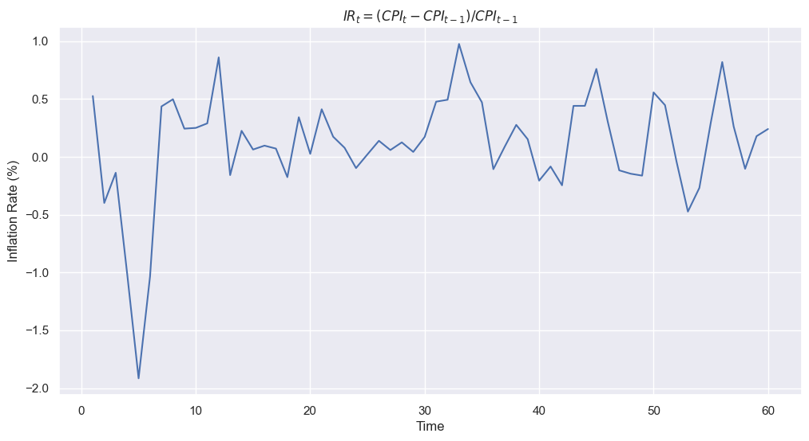
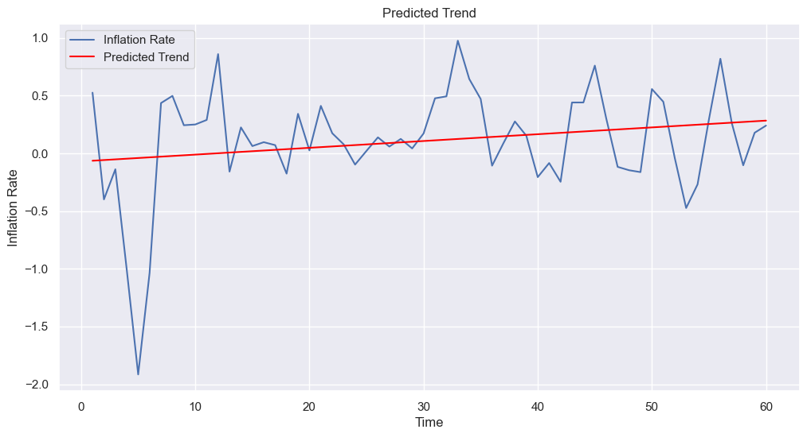
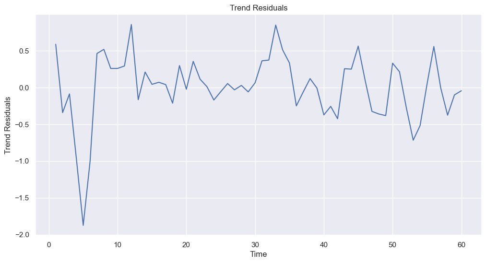
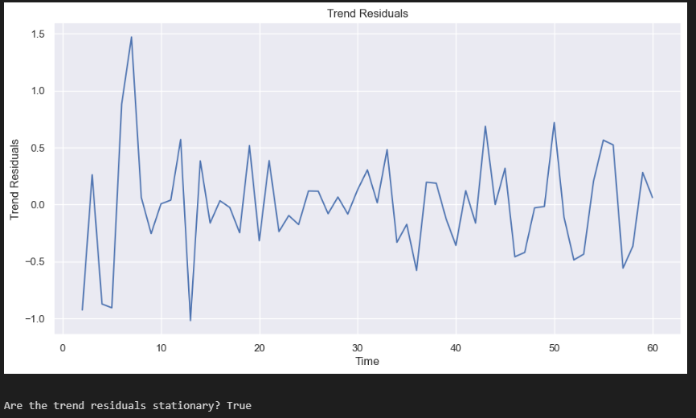
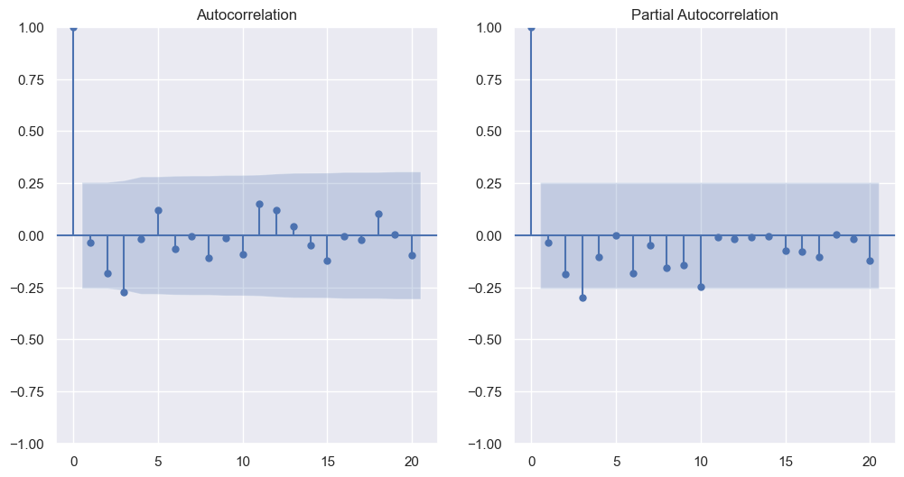
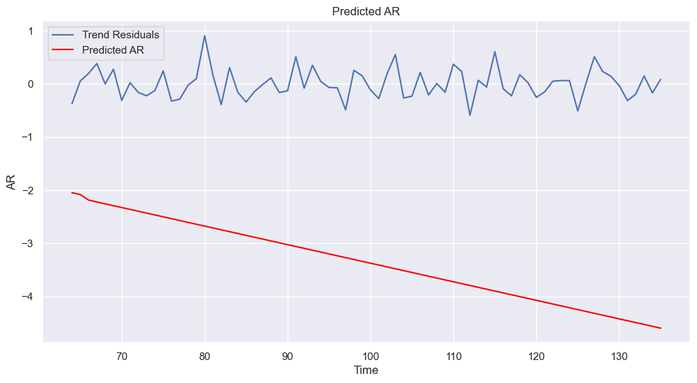

# Module 4 - Time Series: Written Analysis, Peer Review and Discussion

Name: eddysanoli

## Problem 1: The Mauna Loa CO2 Concentration

### The final model

1. (3 points) Plot the periodic signal Pi. (Your plot should have 1 data point for each month, so 12 in total.) Clearly state the definition the Pi, and make sure your plot is clearly labeled.

   

   - After interpolating the periodic signal Pi I realized that the periodic signal was really close to a sinusoid, so I did an additional fit of a sinusoid. The resulting signal is shown in red in the plot above.

2. (2 points) Plot the final fit Fn(ti) + Pi. Your plot should clearly show the final model on top of the entire time series, while indicating the split between the training and testing data.

    

3. (4 points) Report the root mean squared prediction error RMSE and the mean absolute percentage error MAPE with respect to the test set for this final model. Is this an improvement over the previous model Fn(ti) without the periodic signal? (Maximum 200 words.)

    - After calculating the RMSE and MAPE for the model that includes the periodic signal, its evident that there was an improvement on the test set when compared to the model that only includes the trend component. Both the RMSE and MAPE were reduced by approximately 58 and 64 percent respectively. A statistical test should be performed to confirm if the improvement is significant, but the results seem to indicate that the addition of the periodic signal is a good idea.

        

4. (3 points) What is the ratio of the range of values of Fn to the amplitude of Pi and the ratio of the amplitude of Pi to the range of the residual Ri (from removing both the trend and the periodic signal)? Is this decomposition of the variation of the CO2 concentration meaningful? (Maximum 200 words.)

    - According to the problem setup, the decomposition into a trend (F) and a periodic component (Pi) is "meaningful only if range of F is much larger than the amplitude of Pi and this amplitude in turn is substantially larger than that of Ri". When calculating the ratio of the range of F and the amplitude of Pi for the entire dataset, we get a value of ~14.86, which could help confirm that F is much larger than the amplitude of Pi.

        

        However, this changes depending on the dataset we are considering, as the trend increases in a quadratic fashion. We can actually get an equation for range by subtracting two "y" values from the trend equation (F):

        - *range = (A\*x1^2 + B\*x1 + C) - (A\*x2^2 + B\*x2 + C)*
        - *range = A\*(x1^2 - x2^2) + B\*(x1 - x2)*
        - *range = A\*(x1 - x2)(x1 + x2) + B\*(x1-x2)*.
        - *range = (x1 - x2)(A\*(x1 + x2) + B)*

        Considering that in our case A = 0.012, B = 0.802 and C = 314, we can calculate the range for both the training and test sets. The training set starts at x1 = 0 and ends at x2 = 49.46, making the range ~69. The test set starts at x1 = 49.46 and ends at x2 = 61.71, making the range ~12. We can probably just consider the training dataset since that was the one used to create the model itself. Since the amplitude of Pi is 6.42, the ratio of the range of F and the amplitude of Pi now becomes ~10.8, which could still be considered "much larger".

        

        This is great, but what about the ratio of the amplitude of Pi to the range of the residual Ri? The amplitude of Pi is 6.42, and the range of the residual Ri is 4.65, which gives us a ratio of ~1.4. This is not substantially larger, so it could be argued that the decomposition is not meaningful, or that the residuals still hold some information that could be useful. An additional ARIMA model could be fit to the residuals to see if there is any information left there.

        

## Problem 2: Autovariance Functions

1. (4 points) Find the autocovariance function of the MA(1) model,

    Xt = Wt + theta \* W{t-1}

    

2. (4 points) Find the autocovariance function of the AR(1) model,

    Xt = phi \* X{t-1} + Wt,

    
    

 
 
 

## Problem 3: CPI and BER Data Analysis

### Converting to Inflation Rates

#### Exercise 1

Repeat the model fitting and evaluation procedure from the previous page for the monthly inflation rate computed from CPI.

(1 point) Description of how you compute the monthly inflation rate from CPI and a plot of the monthly inflation rate. (You may choose to work with log of the CPI.)

- The equation chosen to calculate the monthly inflation rate was the one that did not use the log of the CPI, as it returned a slightly higher value. I would prefer to overestimate the inflation rate rather than underestimate it, however, the difference is very small. A plot of the monthly inflation rate is shown below.

    

(2 points) Description of how the data has been detrended and a plot of the detrended data.

- Initially tried to detrend the data using a linear fit like how it was done for the CPI. However, when checking the stationarity of the resulting residuals through a Dickey-Fuller test, the results showed that the data was still not stationary. This could probably be because the inflation rate could be technically considered a differentiation of the CPI already, so the linear trend has been already removed.

    
    

    So, what I decided to do was to re-differentiate the data to remove any remaining trends or seasonality. After just 1 additional differentiation, the data became stationary:

    

(3 points) Statement of and justification for the chosen AR(p) model. Include plots and reasoning.

- The order "p" for the AR model was selected by using three elements at once: The ACF plot, the AIC and BIC criterions and the RMSE values for different lags. I created a small parameter sweep for 10 different lags and calculated the different metrics for each one. Then I plotted the metric evolution (AIC, BIC and RMSE) for each lag.

    
    

    The ACF plot shows that there aren't many strong correlations, just maybe one with the third lag in both the PACF and ACF plots. For the AIC and BIC criterions, the ideal lag (with the highest dropoff) seems to be around 4, while the RMSE values seem to indicate that the lower the lag, the better the model. So I decided to go with a very simple AR(1) model.

    Its worth mentioning that we could also try fitting an MA model to the data, to see if the resulting residuals are smaller. However, the use of a simple AR model seems to be enough to generate a relatively good fit.

(3 points) Description of the final model; computation and plots of the 1 month-ahead forecasts for the validation data. In your plot, overlay predictions on top of the data.

- The final model was an AR(1) model applied after a differentiation. Since removing a fitted linear trend to the data didn't seem to make the series stationary, I decided to apply a second differentiation to the data (as the inflation rate already consists of a differentiation of the CPI, which explains why the clear linear trend of the CPI disappeared in the inflation rate). Once this was done, the series became stationary, and an AR(1) model was applied based on the AIC and BIC criterions. The final results generated a relatively satisfactory fit, as the RMSE was 3.445.

Unfortunately I couldn't find a way to properly overlay the predictions on top of the data.

#### Exercise 2

(3 points) Which AR(p) model gives the best predictions? Include a plot of the RMSE against different lags "p" for the model.

In my opinion, the p = 1 AR model gives the best predictions as explained before, however, it could be argued that not applying an AR model at all could also be a good choice, as an MA model could be applied with similar results.

#### Exercise 3

(3 points) Overlay your estimates of monthly inflation rates and plot them on the same graph to compare. (There should be 3 lines, one for each datasets, plus the prediction, over time from September 2013 onward.)
