# Written Report: Environmental Data and Gaussian Processes

## Part I - Ocean Flow

### Problem 2 (10 bonus points)

Rubric:

- (5 points): A map with the two points with correlations marked.
- (3 points): Provides an explanation of how the correlation was computed.
- (2 points): Provides a convincing commentary on why the two marked locations could be correlated.

NOT SOLVED FOR BEING OPTIONAL OR BONUS

### Problem 3.a (10 points)

#### Rubric

- (3 points): Provides an explanation of the simulation algorithm, with equations for the evolution of the particle trajectory.
- (2 points): Provides a plot of the initial state of the simulation.
- (3 points): Provides two plots of intermediate states of the simulation.
- (2 points): Provides a plot of the final state of the simulation.

#### Solution

1. Explanation of the simulation algorithm.

   - The simulation algorithm is very simple. It can be described as the implementation of a particle moving in uniform rectilinear motion across both the x and y axes:

        X_x(t) = X_{xo} + V_x t

        X_y(t) = X_{yo} + V_y t

        When implemented in software, each step in the particle's movement is calculated sequentially, meaning that the values of the previous step are used to calculate the next state of the particle.

        We start with our initial state, the position of the particle at time $t=0$: $(X_{xo}, X_{yo})$ and the velocity of the particle that corresponds to its current position: $(V_x, V_y)$. Since we are analyzing flow, the velocity applied is the velocity of the vector field at the current position of the particle. The velocity of the particle is constant for a given region, so we can think of this as a pseudo-uniform rectilinear motion.

        The next step is to calculate the future position of the particle after moving for a certain amount of time $t$. Since the velocity is only given at discrete points, we approximate current position of the particle to its closest velocity point. This is done by rounding the current position of the particle to the nearest integer on both axis. Once we have the velocity, we need $t$, which in our case simply consists of the time passed between the current step and previous step. The velocity measurements in the data set are take every 3 hours, so $t=3$ (since velocity is given in km/h and the position is in km).

        For a sample data point $(1,2)$ that always travels at a velocity of $V = (1, 1)$, the movement of the particle would look like this for the first three steps:

        | Time | Position | Velocity | Time Elapsed | New Position |
        | ---- | -------- | -------- | ------------ | ------------ |
        | 0    | ---      | ---      | 3            | (1, 2)       |
        | 3    | (1, 2)   | (1, 1)   | 3            | (4, 5)       |
        | 6    | (4, 5)   | (1, 1)   | 3            | (7, 8)       |

        X = (1, 2)

        V = (1, 1)
         
         

        X_x(3) = X_{xo} + V_x t = 1 + 1 * 3 = 4

        X_y(3) = X_{yo} + V_y t = 2 + 1 * 3 = 5

        X(3) = (4, 5)
         
         

        X_x(6) = X_{xo} + V_x t = 4 + 1 * 3 = 7

        X_y(6) = X_{yo} + V_y t = 5 + 1 * 3 = 8

        X(6) = (7, 8)

        At the end, by plotting the position history of the particle, we can see its trajectory. The trajectory would be a straight line for a regular uniform rectilinear motion, but since the velocity changes, the trajectory will consist of a series of straight lines. This could be smoothed out by introducing acceleration into the equation, but unfortunately, acceleration estimation would require things like flow density and mass, which are not given in the data set.

2. Plot of the initial and final states of the simulation. Also show two steps inbetween.

    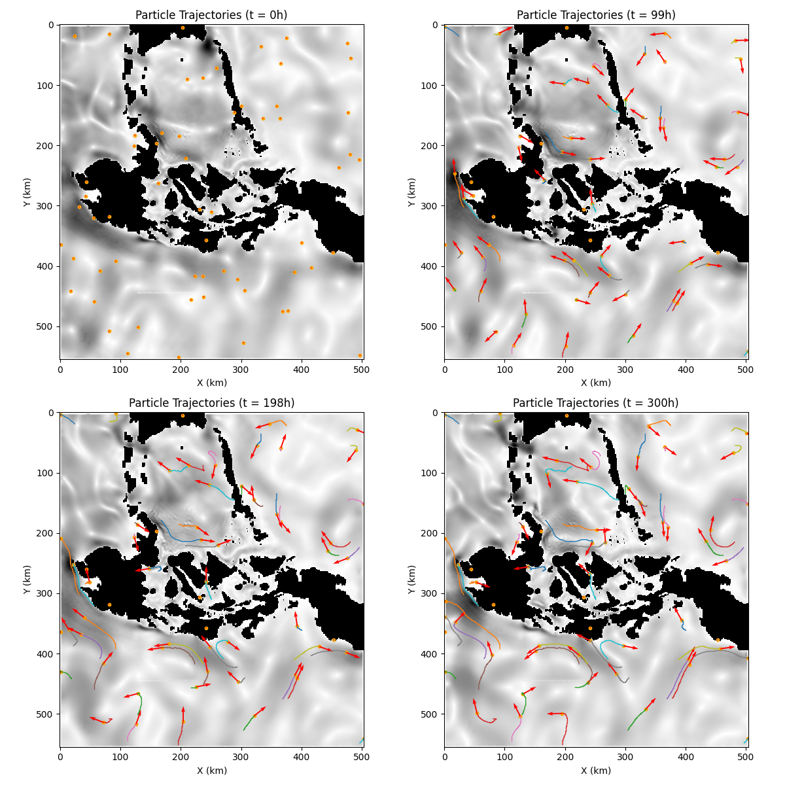

### Problem 3.b (10 points)

#### Rubric

- (3 points): Provides plots showing the state of the simulation at the times: T=48hrs, 72hrs, 120hrs. (Three plots required.)
- (3 points): Two or more additional choices of the variances were tried, and three plots of the state of the simulation at the above three times are provided. (Six additional plots required.)
- (4 points): Comments on where one should concentrate search activities based on the observed results.

#### Solution

When simulating the crash for 120 hours (5 days), it's expected that the higher the variance, the more the search will need to widen in order to find the debris after its movement, as the possible landing site will include more and more of the area surrounding its mean.

This was very clearly seen in the simulation, with the search area increasing only a small amount due to the currents not being particularly strong around the mean of the landing site. However, one crucial thing to note is that, when the variance starts reaching the 100km mark, some of the possible landing sites start to include both the inner section of the Philippine archipelago and part of its land masses. Considering the fact that the currents in this inner section of the archipelago are stronger than the ones found in the east, and the fact that land masses are also possible, the search effort for this toy plane would need to get much bigger in order to cover all the possible landing sites.

The wisest choice would be to concentrate in the east section, as the mean is found there. If not found there, the search could then move on to the inner section of the archipelago. If everything else fails, the search would need to move to the islands between the east and middle sections of the archipelago. This would cover all possible landing sites in order of probability.

----

## Part II - Estimating Flows with Gaussian Processes

### Problem 4.a (10 points)

#### Rubric

- (1 point): States the choice of kernel function and provides a justification for this choice.
- (1 point): Identifies the parameters of the kernel function.
- (1 point): Explicitly states the search space for each kernel parameter.
- (1 point): Explicitly states the number of folds () for the cross-validation.
- (3 points): Provides the optimal kernel parameters from the search.
- (3 points): Provides a plot of the computed cost/performance metric over the search space for the kernel parameters.

#### Solution

1. The kernel function was chosen via trial and error. Initially, to simplify the process, I decided to use the squared exponential kernel function (also called radial basis kernel or RBF) because of its general popularity in things like gaussian processes and SVM's. However, the resulting fit was a bit noisy and almost seemed to diverge as time incremented.

    

    Even though I later found out that this error was due to a poor choice of prior mean, I decided to try another kernel function to see if the fit improved. Another similar kernel suggested by [David Duvenaud](https://www.cs.toronto.edu/~duvenaud/cookbook/), is the rational quadratic. After trying it, I found that the fit improved, but not as much as I would have liked. The predictions kept "diverging". After a thorough check of my logic, I found the error in the prior mean, and fixed it. The RBF kernel started working immediately, and I decided to stick with it. Retried using the rational quadratic kernel as well, but the variance was way too tight around the predicted mean, causing some of the training data to fall outside of the area of uncertainty (area marked between 3 times the variance above and below the mean. Colored in gray in the chart below).

    

2. Optimized the RBF kernel by training it on data for the velocities in point (400, 200). The following parameters were found for each of the velocity components:

    

3. The search space was determined via two phases. The first phase consisted of a coarse search done to roughly determine the area where the optimal parameters would be found. This was the search space:

   - Length scale (l): 18 points between 0.1 and 5
   - Variance (sigma): 5 points between 0.1 and 2

    

   After that phase, it was clear that the optimal length for both velocity components should be close to 2.12, while the optimal variance should be 0.1. The second phase then consisted of a finer search done around the (2.12, 0.1) area:

   - Length scale (l): 25 points between 1 and 3
   - Variance (sigma): 10 points between 0.1 and 0.10

    

4. 20 folds were used for the cross-validation in all cases

5. The optimal kernel parameters were found to be:

   - Length scale (l): 2.0
   - Variance (sigma): 0.1

   for the X component, and

    - Length scale (l): 2.17
    - Variance (sigma): 0.1

    for the Y component.

6. The last plot found in the 3rd point of this problem shows the cost/performance metric over the finer search space. The optimal parameters are marked with a red cross for clarity. If we were to interpret the lighter colors as a higher height, and the lower colors as valleys, we can see that the surrounding area of the finer grid search shows a clear increase towards the optimal parameters found, confirming that the parameters were probably chosen correctly.

### Problem 4.b (5 points)

#### Rubric

- (3 points): Provides the optimal kernel values for three new location that are different from the location in Problem 4.a. (Plots do not need to be provided.)
- (2 points): For each kernel parameter, states if a pattern was observed.

#### Solution

1. The following positions were chosen for the new locations

    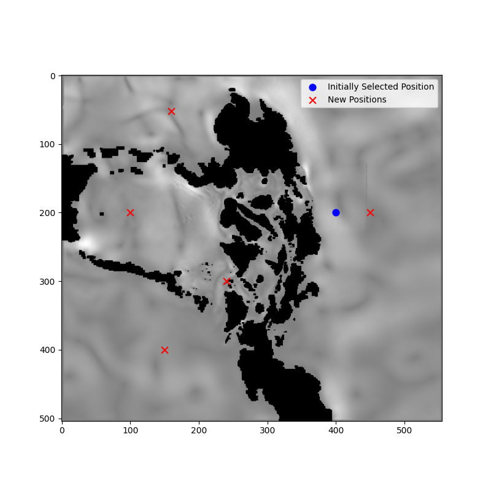

    They were chosen since each of them cover a different section of the Philippine archipelago. The first one in the south China sea (bottom left), the second one in the Lusu sea (middle left), the third one in the philippine sea (middle right), the fourth one in Celebes sea (top left), and the last one near the Panay coast. We provide the search space and optimal parameters found for each of the new locations:

    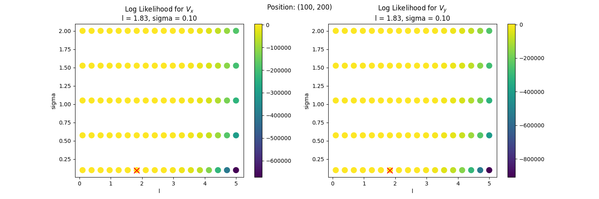
    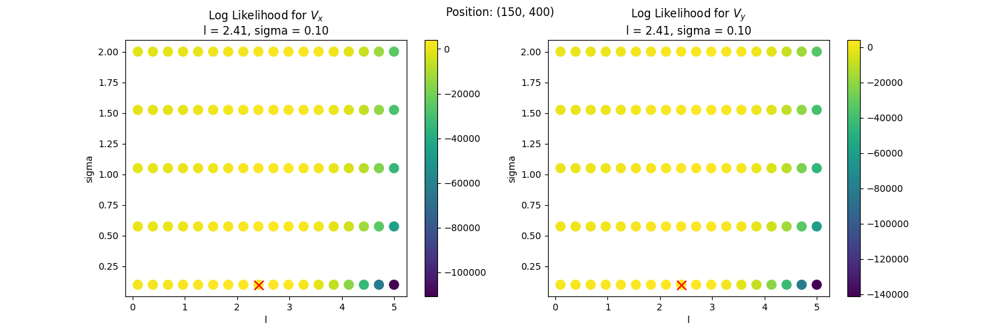
    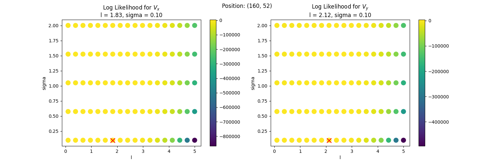
    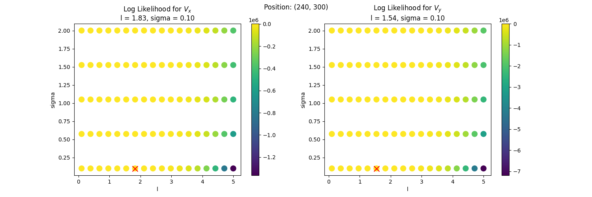
    

2. The following patterns were observed:

    - The log likelihood always starts decreasing as we approach a value of 4 for the length scale parameter.
    - The ideal length scale varies between 1.83 and 2.41 for both the X and Y components. The variance seems to remain constant in all cases at 0.1 (lower bound of the search space)
    - The variance parameter always tends to go to the lowest value possible. Tried expanding the lower range of the search space for the variance parameter (sigma), but the final fit didn't actually seem to improve, tightening the uncertainty area around the predicted mean, but leaving more and more training data unaccounted for.

### Problem 4.c (5 points)

#### Rubric

- (1 point): Provides the optimal kernel values for at least two new choices of Tau.
- (2 points): A plot showing the cost/optimization target is provided for the search space, for each choice of Tau.
- (2 points): Comments on whether these results differ from those found in Problem 4.a, and on whether results from the choices of Tau in the problem differ from each other.

#### Solution

1. The following values of Tau were chosen:

    - 0.0001
    - 0.01
    - 0.1
    - 1

    These were the search spaces and optimal parameters obtained for each velocity component and choice of Tau:

    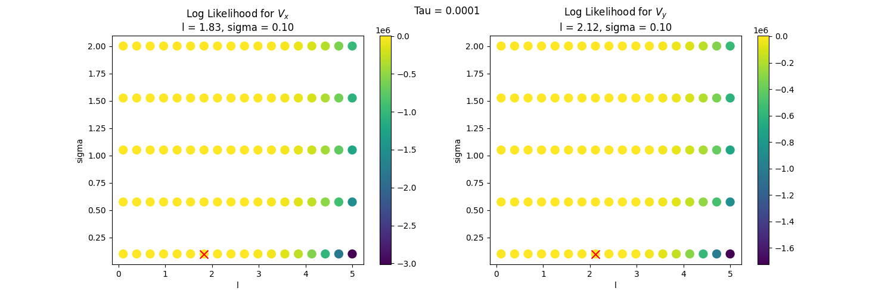
    
    
    

2. Please see the plots provided in the previous point.

3. The results are generally the same as the ones obtained in both problems 4.a and 4.b, with the length scale parameter varying between values close to 1.83 and 2.12, the variance going to the lowest possible value, and the log likelihood decreasing as we approach a length scale of 4. The only difference seems to be that as Tau increases, the length scale parameter starts decreasing.

   This could probably be thought of as the length scale compensating for the increase in observation noise. Since it cannot "trust" the far away neighbors as much, it needs to decrease the length scale to now focus on the closer neighbors or the finer details of the data. It basically starts losing the capacity of capturing the broader patterns in the data, focusing more on the local patterns.

### Problem 4.d (10 points)

#### Rubric

- (2 points): Provides the optimal kernel parameters as found through the software library.
- (2 points): Provides details on the library used.
- (2 points): Comments on whether these results differ from those found in Problem 4.a.
- (2 points): The results are the same, or, the results are different and an explanation is provided.
- (2 points): A plot showing the cost/optimization target is provided for the search space, or a plot comparing the predictions generated (in problem 5) if the results are different.

#### Solution

1. The following values were obtained for the kernel parameters:

    - Length scale (l) for Vx: 1.74
    - Length scale (l) for Vy: 1.9011

2. The library used was `scikit-learn`, specifically the `sklearn.gaussian_process.GaussianProcessRegressor` class with the `RBF` kernel.

3. The parameters found actually differ a lot from the ones found in problem 4.a. The main difference is that they are much lower, but its also worth mentioning that the optimized kernel is slightly different, as the RBF kernel used by `scikit-learn` does not include a variance parameter to scale the results. This in term probably forced the internal optimization that `scikit-learn` uses to find a different solution.

### Problem 5 (15 points)

#### Rubric

- (2 points): Clearly states the choice of time-stamps at which to create predictions, and states why the choice was made.
- (2 points): Clearly states the method by which the prior means were chosen.
- (2 points): Provides a plot with a prediction for the horizontal velocity component at the chosen location.
- (2 points): Provides a plot with a prediction for the vertical velocity component at the chosen location.
- (3 points): Both plots have a labelled prediction for the mean for all of the time-stamps chosen.
- (3 points): Both plots have a labelled  band around the predicted mean for all of the time-stamps chosen.
- (1 point): Both plots have the observations included.

#### Solution

1. Initially it was considered that a good idea was to simply interpolate to gain back the 3 hour timeframe that we initially had in the first part of the project. However, in later simulation steps it seems like a day to day estimate is more than enough to be useful, so a prediction for every 24 hours was chosen. This meant that 2 additional points were inserted in between the existing time indexes. So, if our initial data was [0, 1, 2], the new time indexes would be [0, 0.33, 0.66, 1, 1.33, 1.66, 2].

2. 3 methods were tested to generate the prior means: Moving average with a 5 sample window, zeros for all values and the mean of the training data. The moving average was found to cause the "divergent" behavior that caused problems when selecting the kernel in point 4.a, so it was quickly discarded. The remaining methods generated pretty similar results, but assuming that the mean was initially zero seemed to be the best choice, as it generated the best uncertainty region: Tight around the mean, but still including all of the observations.

3. Plot for both the horizontal and vertical velocity components:

    

4. The previous figure includes a plot on the right for the vertical velocity component.
5. The mean can be seen in the provided figure as an orange line
6. The labelled uncertainty band can be seen around the mean in the provided figure. The top part of the band is 3 variances above the mean, and the bottom part is 3 variances below the mean.
7. The training observations can be seen in the provided figure as blue crosses.

### Problem 6.a (15 points)

#### Rubric

- (2 points): Provides a plot with the initial state of the simulation.
- (2 points): Provides a plot with an intermediate state of the simulation.
- (2 points): Provides a plot with the final state of the simulation.
- (2 points): Marks a location on the coast of the final state of the simulation where one should search for debris and provides a justification.
- (2 points): Marks a location over the ocean of the final state of the simulation where one should search for debris and provides a justification.
- (5 points): Provides three plots (initial, intermediate, final) for one other choice of sigma, and comments on results (either to state why conclusions should change or why they should not).

#### Solution

1. A simulation of multiple possible crash locations was generated for the toy plane that crashed at (300km, 1050km). A relatively low variance of 30km was used, because it was assumed that the initial crash location was well known. These are the plots for the debris progression at 0 days, 149 days and 298 days.

    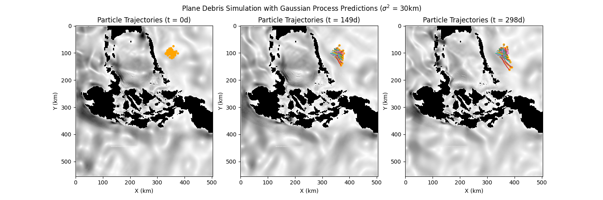

    In this scenario, the plane debris would've been found in the ocean, around a relatively small ellipsoidal region near the mean of the possible crash locations. The debris could've never been found in the shore, since most of the currents in a 30km radius point towards the south, and lack the strength to push the debris to the upper east coast of the archipelago, even after almost a year.

    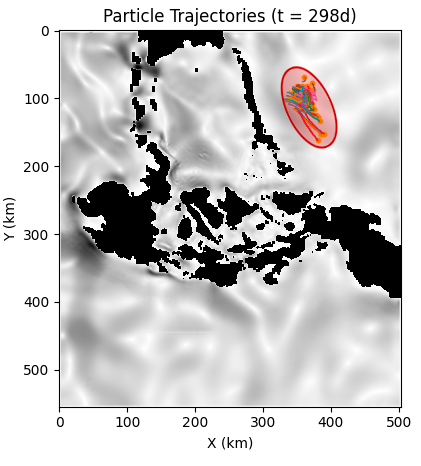

2. The crash could've also happened without the original location being as well known as it was originally assumed. In order to model this, two additional simulations were generated with a higher variance of 50 and 100km.

    
    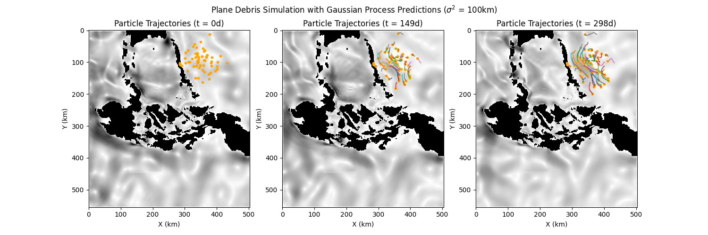

    With this new set of variances, the particle trajectories obviously diverge a lot more, causing the debris to now be able to reach the Palawan coast (especially in the 100km variance case. Marked in blue in the figure below). However, even in this case, the currents still point towards the south, so most of the debris would still be found at sea, near Manila or in the south china sea (marked in red). There is a small percentage of objects that remain relatively static, as the speed of the currents in a nearby region is very low. However, most of the currents point south, so the debris would eventually be pushed towards the highlighted red region.

    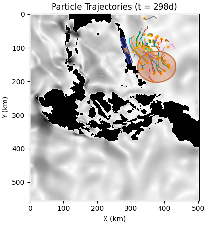

### Problem 6.b (14 points)

#### Rubric

- (2 points): Provides a plot with the initial state of the simulation, there should be no particles on land.
- (2 points): Provides a plot with an intermediate state of the simulation.
- (2 points): Provides a plot with the final state of the simulation.
- (4 points): Marks three locations on the final state of the simulation where monitoring stations should be placed.
- (4 points): Provides a convincing explanation for choosing these locations.

#### Solution

For this problem, we need to gather as much data on the movement of particles around the archipelago. Because of this, a total of 500 particles were simulated. Their initial state was randomly generated uniformly around the map, making sure to remove all particles that were initially on land, and around coasts. A simulation with seed 42 was generated, and the following plots were generated for the initial, intermediate and final states of the simulation.

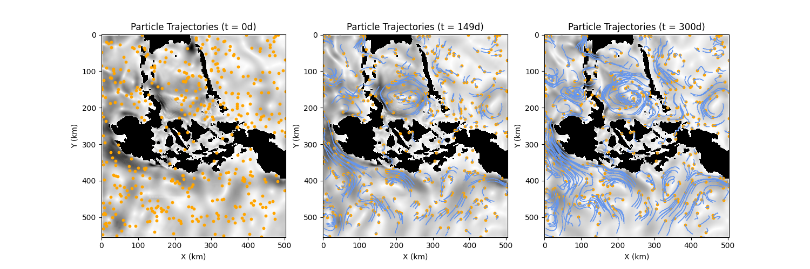

These plots are very interesting, as with this amount of particles, you can start noticing that the trails that the particles leave behind start tracing the natural flow of the currents in the surrounding seas. This flow could be used to trace the points where the particles eventually merge and then crash into the coast. However, this can be disingenuous as a different set of initial positions could lead to a different set of crashes into the coast. Because of this, it was decided to run multiple simulations with different seeds, and then try to locate the common places where particles tend to crash into the coast. The following figure shows the results of 4 5000-particle simulations, each one with a different seed.

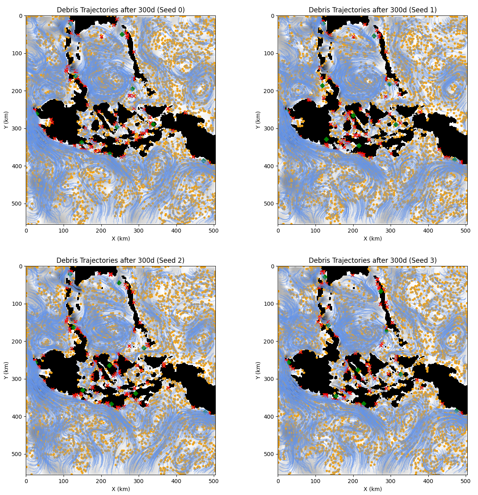

The red marks in the plots show locations where the particles crashed into the coast. As expected, the clusters of crashes vary between simulations, but there are some locations that consistently amass a lot of crashes. To more easily visualize the "core" of these clusters, the crashes were taken and then clustered using the k-means algorithm with a K = 10. The cluster centers consist of the green diamonds seen above.

After analyzing the flow data, and the cluster centers generated, the following locations were chosen as the best places to put monitoring stations:

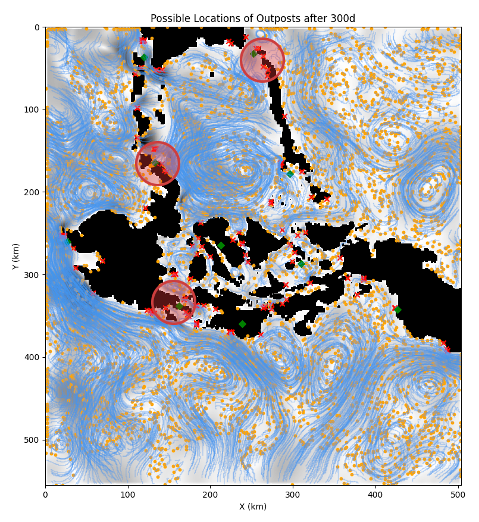

The first one should be placed at the top of "North Zamboanga", as the four simulations coincided in the placement of a cluster center near that location. The second one is in "North Surigao", once again because four of the simulations placed a cluster center there, and there seems to be a large current that flows next to that area, sometimes crashing into the coast. The third one was difficult, as there wasn't a consensus, and the rest of the cluster centers were placed near the previous two possible monitoring stations. A monitoring station should also focus in covering a larger variety of locations, in order to get a better idea of how much debris is floating around the archipelago. Because of this, the third monitoring stations was placed in "North Palawan", as it is the furthest away from the other two, its able to cover the south china sea region and it consistently amasses a lot of crashes in the simulations.

Although the previous locations can be thought of as the best places to put monitoring stations, I would still recommend the addition of a fourth monitoring station in one of the inner sections of the archipelago, as this would cover a lot of the small landmasses that are not covered by the other three stations near the big water bodies.